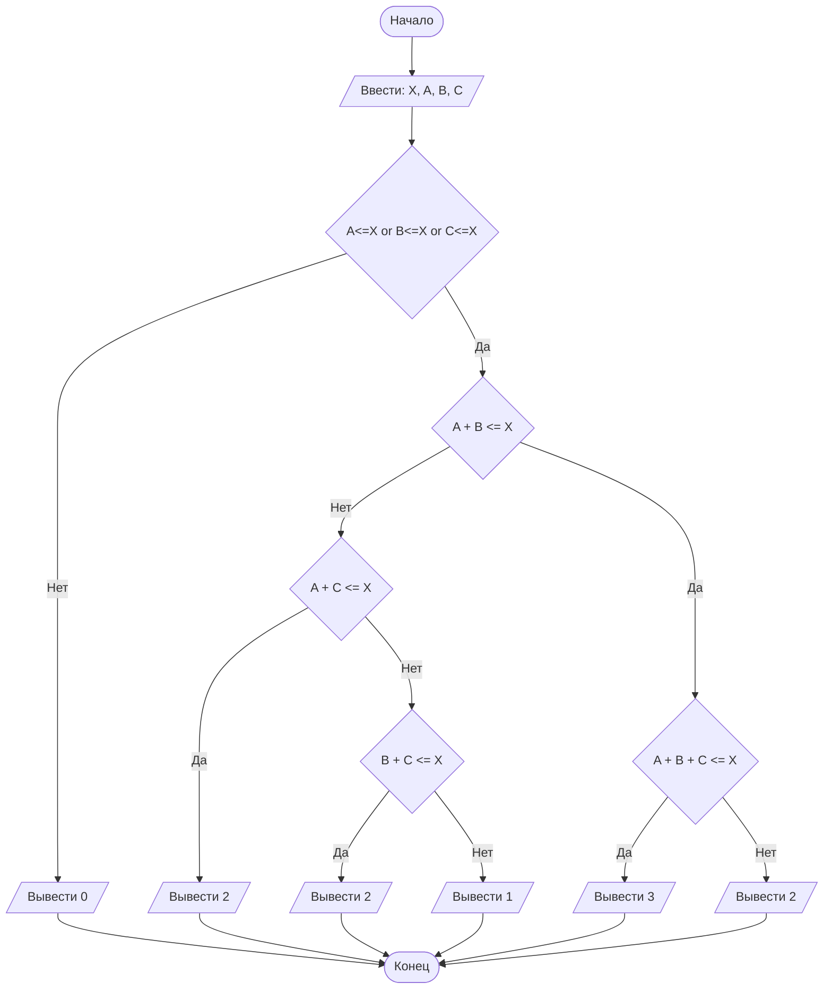

## Отчет по лабораторной работе № 1

#### № группы: `ПМ-2402`

#### Выполнил: `Сорокин Арсений Михайлович`

#### Вариант: `23`

### Cодержание:

- [Постановка задачи](#1-постановка-задачи)
- [Входные и выходные данные](#2-входные-и-выходные-данные)
- [Выбор структуры данных](#3-выбор-структуры-данных)
- [Алгоритм](#4-алгоритм)
- [Программа](#5-программа)
- [Анализ правильности решения](#6-анализ-правильности-решения)

### 1. Постановка задачи

> В лифте с максимальной грузоподъемностью X кг находятся три человека
> с весом A, B, C кг. Необходимо определить, скольких человек лифт смо
> жет поднять одновременно, не превышая допустимую нагрузку. На вход
> программы подаются натуральные числа X, A, B, C.

Данную задачу можно разделить на 5 подзадач: убедиться что хотя бы один человек может быть поднятым лифтом,
проверить сможет ли лифт поднять людей с весом А и B, если да то попробовать добавить человека с весом C,
если нет то проверить сможет ли лифт поднять людей с весом А и C, или проверить сможет ли лифт поднять людей с весом B и C.

- Для 1 подзадачи нужно рассмотреть 2 случая:
    1. `A <= X || B <= X || C<=X`
    2. `A > X && B > X %% C>X` (отрицание 1 случая)
- Для 2 подзадачи нужно также рассмотреть 2 случая:
    1. `A + B <= X`
    2. `A + B > X` (отрицание 1 случая)
- Для 3 подзадачи нужно рассмотреть 2 случая:
    1. `A + B + C <= X`
    2. `A + B + C > X` (отрицание 1 случая)
- Для 4 подзадачи нужно рассмотреть 2 случая:
    1. `A + C <= X`
    2. `A + C > X` (отрицание 1 случая)
- Для 5 подзадачи нужно рассмотреть 2 случая:
    1. `B + C <= X`
    2. `B + C > X` (отрицание 1 случая)

Всего надо рассмотреть `2 * 5 = 10` случаев.

### 2. Входные и выходные данные

#### Данные на вход

На вход программа должна получать 4 числа, при этом в условии сказано, что они принадлежат натуральным числам. 

|                                    | Тип               | min значение | max значение |
|------------------------------------|-------------------|--------------|--------------|
| X (Грузоподъемность лифта)         | Натуральное число |       1      |     2000     |
| A (Человек с весом A килограммов)  | Натуральное число |       1      |     1000     |
| B (Человек с весом B килограммов)  | Натуральное число |       1      |     1000     |
| C (Человек с весом C килограммов)  | Натуральное число |       1      |     1000     |


#### Данные на выход

Так как программа должна вывести число людей, которых одновременно сможет поднять лифт, то
число должно быть целым неотрицательным числом меньше или равняющееся 3 так как всего может
быть поднято одновременно 3 человека.

|       | Тип                         | min значение | max значение |
|-------|-----------------------------|--------------|--------------|
| Число | Целое неотрицательное число |       0      |       3      |

### 3. Выбор структуры данных

Программа получает 4 натуральных числа. Так же из-за того что в задании речь идёт о весе людей то 
типа данных Byte может не хватить, так как грузоподъемность или вес могут быть больше 127, поэтому
я принял решение использовать тип данных Short так как вес людей в килограммах и грузоподъемность 
точно меньше чем 32767 килограммов. Поэтому для их хранения можно выделить 4 переменных 
(`lift_capacity`  `person_a` `person_b` и `person_c`) типа `short`.

|                                   | название переменной | тип в java | 
|-----------------------------------|---------------------|------------|
| X (Грузоподъемность лифта)        | `lift_capacity`     | `short`    |
| A (Человек с весом A килограммов) | `person_a`          | `short`    |
| B (Человек с весом B килограммов) | `person_b`          | `short`    |
| C (Человек с весом C килограммлв) | `person_c`          | `short`    | 

Для результата необязательно использовать переменную.

### 4. Алгоритм

#### Алгоритм выполнения программы:

1. **Ввод данных:**  
   Программа считывает четыре целых неотрицательных числа, обозначенные как `lift_capacity`, `person_a`, `person_b` и `person_c`.

2. **Сравнение грузоподъемности с весом людей А B и C:**  
   Программа сравнивает вес A B и C каждого человека с грузоподъемностью, чтобы определить что хотя бы одного человека лифт смог поднять.

4. **Рассмотрение различных случаев:**
    - Если первое условие **не сработало** программа выводит **0** - так как лифт не сможет поднять ни одного человека
    - Если первое условие **выполнилось**,
      - проверяется что люди с весом А + B могут подняться одновременно т.е. person_a + person_b <= lift_capacity
         - **если верно**, то программа добавляет человека с весом C и проверяет person_a + person_b + person_c <= lift_capacity
           - **если верно**, то выводится **3** т.е. все люди могут подняться одновременно
           - **если неверно**, то выводится **2** (лифт с человеком с весом C не сможет подняться, также возможен и случай что поднимуться люди
             с весом B и C или A и C, но нам важно только количество а оно во всех случаях равно 2)
         - если **неверно**, то программа проверяет случай person_a + person_c <= lift_capacity
           - если он **верен**, то выводится **2** т.к. A + B > X а значит рассматривать случай A + B + C <= X не нужно
           - если он **не верен**, то проверяется случай person_b + person_c <= lift_capacity
             - если **верно**, то выводится **2** т.к. A + B > X и A + C > X значит рассматривать случай A + B + C <= X не нужно
             - если **неверно**, то выводится **1** т.к. в начале проверялось что с хотя бы одним человеком лифт сможет подняться
               

5. **Вывод результата:**  
   На экран выводится либо 0, если лифт не сможет никого поднять, либо 1 или 2 или 3 в зависимости от заданных параметров.

#### Блок-схема



### 5. Программа

```java
import java.util.Scanner;
public class Main {
    public static void main(String[] args) {
        // Создание объекта sc класса Scanner для ввода данных
        Scanner sc = new Scanner(System.in);

        // Считывание целочисленных чисел Грузоподъемность, Вес человек A B C
        short lift_capacity = sc.nextShort();
        short person_a = sc.nextShort();
        short person_b = sc.nextShort();
        short person_c = sc.nextShort();

        // Проверка чтобы хотя бы одного человека лифт мог бы поднять, если не выполняется выводится
        // 0 - количество людей, которых сможет поднять лифт
        if (person_a<=lift_capacity || person_b<=lift_capacity || person_c<=lift_capacity) {
            // Если вес людей А и B меньше или равен грузоподъемности то можно попробовать добавить человека C,
            // иначе проверить сочетание веса людей А и C
            if (person_a + person_b <= lift_capacity) {
                // Если вес людей A B и C меньше или равен грузоподъемности тогда выводим 3 -
                // то есть лифт может поднять всех людей, иначе лифт может поднять только людей A и C выводим 2
                if (person_a + person_b + person_c <= lift_capacity) {
                    System.out.print(3);
                }
                else {
                    System.out.print(2);
                }
            }
            else {
                // Так как грузоподъемность лифта оказалась меньше веса людей A и B, проверяем сочетание
                // веса людей A и C, если их сумма меньше или равна грузоподъемности, выводим 2 человека
                // сможет поднять лифт, иначе проверяем оставшийся случай с весом людей B и C
                if (person_a + person_c <= lift_capacity) {
                    System.out.print(2);
                }
                else {
                    // Если вес людей A и C меньше или равен грузоподъемности сразу выводим 2 (так как с третьим
                    // человеком вес будет точно выше грузоподъемности A+B>X), иначе выводим 1 (так как изначально была
                    // проверка, что вес хотя бы одного человека меньше или равен грузоподъемности, а какой именно
                    // человек нам знать не важно)
                    if (person_b + person_c <= lift_capacity) {
                        System.out.print(2);
                    }
                    else {
                        System.out.print(1);
                    }
                }
            }
        }
        else {
            System.out.print(0);
        }
    }
}
```

### 6. Анализ правильности решения

Программа работает корректно на всем множестве решений с учетом ограничений.

1. Тест на `X >= A + B + C`:

    - **Input**:
        ```
        500 75 85 95
        ```

    - **Output**:
        ```
        3
        ```

2. Тест на `X < A && X < B && X < C`:

    - **Input**:
        ```
        99 101 102 103
        ```

    - **Output**:
        ```
        0
        ```

3. Тест на `(X > A || X > B || X > C) && (X >= A + B) && (X < A + B + C)`:

    - **Input**:
        ```
        250 150 99 101 
        ```

    - **Output**:
        ```
        2
        ```
4. Тест на `(X > A || X > B || X > C) && (X < A + B) && (X >= A + C)`:

    - **Input**:
        ```
        500 120 130 251
        ```

    - **Output**:
        ```
        2
        ```
5. Тест на `(X > A || X > B || X > C) && (X < A + B) && (X < A + C) && (X >= B + C)`:

    - **Input**:
        ```
        500 450 101 99
        ```

    - **Output**:
        ```
        2
        ```
6. Тест на `(X > A || X > B || X > C) && (X < A + B) && (X < A + C) && (X < B + C)`:

    - **Input**:
        ```
        300 201 101 202
        ```

    - **Output**:
        ```
        1
        ```
