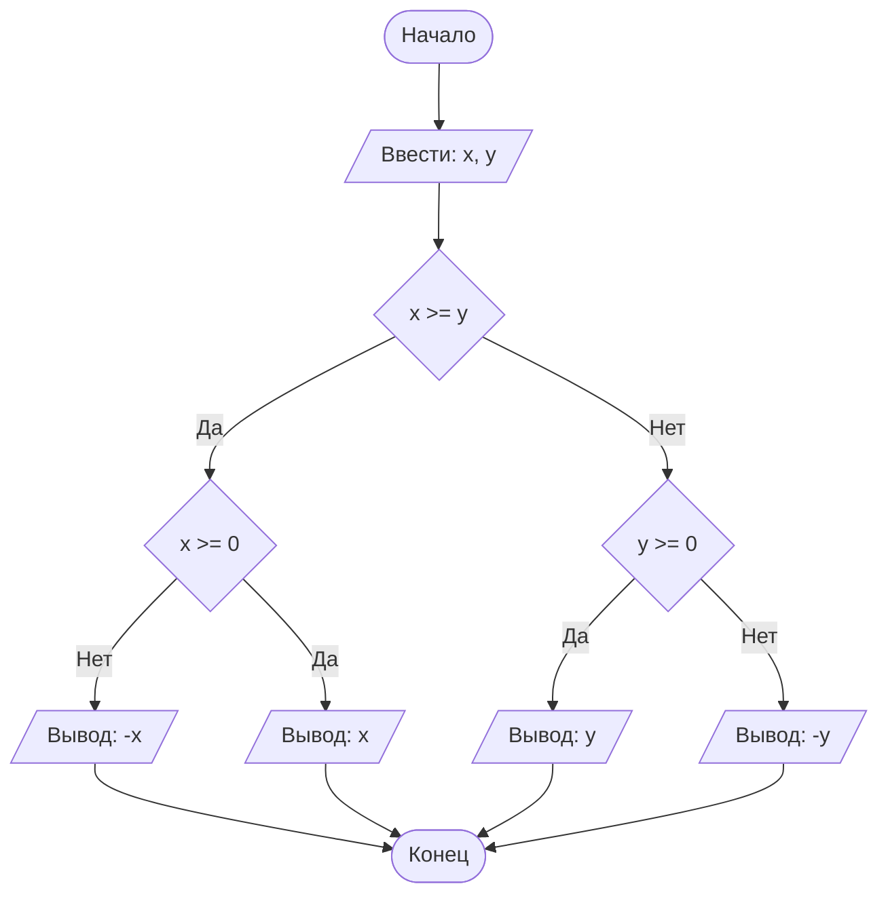

## Отчет по лабораторной работе № 1

#### № группы: `ПМ-2402`

#### Выполнил: `Сорокин Арсений Михайлович`

#### Вариант: `23`

### Cодержание:

- [Постановка задачи](#1-постановка-задачи)
- [Входные и выходные данные](#2-входные-и-выходные-данные)
- [Выбор структуры данных](#3-выбор-структуры-данных)
- [Алгоритм](#4-алгоритм)
- [Программа](#5-программа)
- [Анализ правильности решения](#6-анализ-правильности-решения)

### 1. Постановка задачи

> В лифте с максимальной грузоподъемностью X кг находятся три человека
> с весом A, B, C кг. Необходимо определить, скольких человек лифт смо-
> жет поднять одновременно, не превышая допустимую нагрузку. На вход
> программы подаются натуральные числа X, A, B, C.

Данную задачу можно разделить на 5 подзадач: убедиться что хотя бы один человек может быть поднятым лифтом,
проверить сможет ли лифт поднять людей с весом А и B, если да то попробовать добавить человека с весом C,
иначе проверить сможет ли лифт поднять людей с весом А и C, или проверить сможет ли лифт поднять людей с
весом B и C.

- Для 1 подзадачи нужно рассмотреть 2 случая:
    1. `X >= Y`
    2. `X < Y` (отрицание 1 случая)
- Пусть `Z = max(X, Y)`, тогда для 2 подзадачи нужно также рассмотреть 2 случая:
    1. `Z >= 0`
    2. `Z < 0` (отрицание 1 случая)

Всего надо рассмотреть `2 * 2 = 4` случая.

### 2. Входные и выходные данные

#### Данные на вход

На вход программа должна получать 4 числа, при этом в условии сказано, что они принадлежат натуральным числам. 

|                                  | Тип               | min значение | max значение |
|----------------------------------|-------------------|--------------|--------------|
| X (Грузоподъемность лифта)       | Натуральное число |       1      |    32767     |
| A (Человек с весом A килограмм)  | Натуральное число |       1      |    32767     |
| B (Человек с весом B килограмм)  | Натуральное число |       1      |    32767     |
| C (Человек с весом C килограмм)  | Натуральное число |       1      |    32767     |


#### Данные на выход

Так как программа должна вывести число людей, которых одновременно сможет поднять лифт, то
число должно быть целым неотрицательным числом.

|       | Тип                         | min значение | max значение |
|-------|-----------------------------|--------------|--------------|
| Число | Целое неотрицательное число |       0      |       3      |

### 3. Выбор структуры данных

Программа получает 4 натуральных числа. Так же из-за того что в задании речь идёт о весе людей то 
типа данных Byte может не хватить, так как грузоподъемность или вес могут быть больше 127, поэтому
я принял решение использовать тип данных Short так как вес людей в килограммах и грузоподъемность 
точно меньше чем 32767 килограмм. Поэтому для их хранения можно выделить 4 переменных 
(`lift_capacity`  `person_a` `person_b` и `person_c`) типа `short`.

|                                 | название переменной | тип в java | 
|---------------------------------|---------------------|------------|
| X (Грузоподъемность лифта)      | `lift_capacity`     | `short`    |
| A (Человек с весом A килограмм) | `person_a`          | `short`    |
| B (Человек с весом B килограмм) | `person_b`          | `short`    |
| C (Человек с весом C килограмм) | `person_c`          | `short`    | 

Для результата необязательно использовать переменную.

### 4. Алгоритм

#### Алгоритм выполнения программы:

1. **Ввод данных:**  
   Программа считывает четыре целых неотрицательных числа, обозначенные как `lift_capacity`, `person_a`, `person_b` и `person_c`.

2. **Сравнение чисел:**  
   Программа сравнивает значения `x` и `y`. Если `x` больше или равно `y`, программа переходит к следующему шагу для
   работы с `x`. Если `y` больше, программа выполняет действия для работы с `y`.

3. **Проверка знака для выбранного числа:**
    - Если было выбрано число `x` (так как оно больше или равно `y`), проверяется, положительное оно или отрицательное.
      Если `x` положительное, оно выводится на экран. Если отрицательное, выводится его модуль (т.е. противоположное
      по знаку значение).
    - Если было выбрано число `y` (поскольку оно больше `x`), выполняется аналогичная проверка. Если `y` положительное,
      оно выводится на экран. Если отрицательное, выводится его модуль.

4. **Вывод результата:**  
   На экран выводится либо большее из чисел, либо его модуль, если это число отрицательное.

#### Блок-схема



### 5. Программа

```java
import java.io.PrintStream;
import java.util.Scanner;

public class Main {
    // Объявляем объект класса Scanner для ввода данных
    public static Scanner in = new Scanner(System.in);
    // Объявляем объект класса PrintStream для вывода данных
    public static PrintStream out = System.out;

    public static void main(String[] args) {
        // Считывание двух вещественных чисел x и y из консоли
        double x = in.nextDouble();
        double y = in.nextDouble();

        // Определение максимального числа
        if (x >= y) {
            // Если x положительное, выводим x, иначе выводим -x,
            // чтобы на выходе было его абсолютное значение
            if (x >= 0) {
                out.println(x);
            } else {
                out.println(-x);
            }
        } else {
            // Если x положительное, выводим y, иначе выводим -y,
            // чтобы на выходе было его абсолютное значение
            if (y >= 0) {
                out.println(y);
            } else {
                out.println(-y);
            }
        }
    }
}
```

### 6. Анализ правильности решения

Программа работает корректно на всем множестве решений с учетом ограничений.

1. Тест на `X > Y > 0`:

    - **Input**:
        ```
        5 1.3
        ```

    - **Output**:
        ```
        5
        ```

2. Тест на `X < Y < 0`:

    - **Input**:
        ```
        -4 -2.2
        ```

    - **Output**:
        ```
        2.2
        ```

3. Тест на `X < 0 < Y`:

    - **Input**:
        ```
        -4 5
        ```

    - **Output**:
        ```
        5
        ```

4. Тест на `X = 0` или `Y = 0`:

    - **Input**:
        ```
        0 -3
        ```

    - **Output**:
        ```
        3
        ```

5. Тест на ограничение задачи:

    - **Input**:
        ```
        -1000000000 1000000000
        ```

    - **Output**:
        ```
        1000000000
        ```
